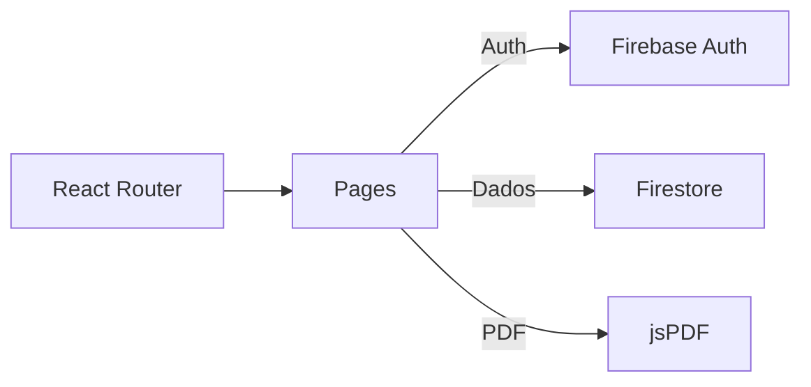

# Plataforma de Cursos Online (React + Firebase)

## Tecnologias
- React + Vite
- Firebase (Auth + Firestore)
- TailwindCSS
- React Router
- jsPDF (geração de certificado)

## Como rodar
1. **Pré-requisitos**: Node.js 18+ e npm.
2. Clone o repositório (ou baixe o `.zip`).
3. No diretório do projeto, copie `.env.example` para `.env` e preencha as chaves do Firebase:
```bash
cp .env.example .env
```
4. Instale as dependências e rode em dev:
```bash
npm install
npm run dev
```
5. No primeiro uso, acesse `http://localhost:5173/admin` e clique em **Criar dados de exemplo**.
6. Vá para **/courses** → escolha o curso → **Lesson** → faça o **Quiz** → gere o **Certificado**.

> Habilite no Firebase: **Authentication** (Google + Email/Senha) e **Firestore** (no modo protegido). Publique as **Regras** de `firestore.rules`.

## Segurança
- Leitura liberada para usuários autenticados.
- Escrita apenas para administradores (custom claim `admin=true`). Veja instruções no arquivo **README-ADMIN.md**.

## Estrutura
```
e-learning-react-firebase/
├─ src/
│  ├─ pages/ (Home, Login, Courses, CourseDetail, Lesson, Quiz, Profile, Admin, Certificate)
│  ├─ providers/ (AuthProvider.jsx)
│  ├─ routes/ (ProtectedRoute.jsx)
│  ├─ firebase.js
│  ├─ main.jsx, App.jsx, index.css
├─ firestore.rules
├─ .env.example
├─ README.md
```
## Quiz
- Cada aula pode ter um quiz (coleção `quizzes`, id: `courseId__lessonId`).  
- Caso não exista, um quiz **exemplo** é exibido para teste.

## Certificado
- Após ser aprovado (nota ≥ 70%), o aluno pode gerar e baixar um PDF personalizado com **nome**, **curso**, **aula**, **data** e **nota**.

## Arquitetura (mermaid)

